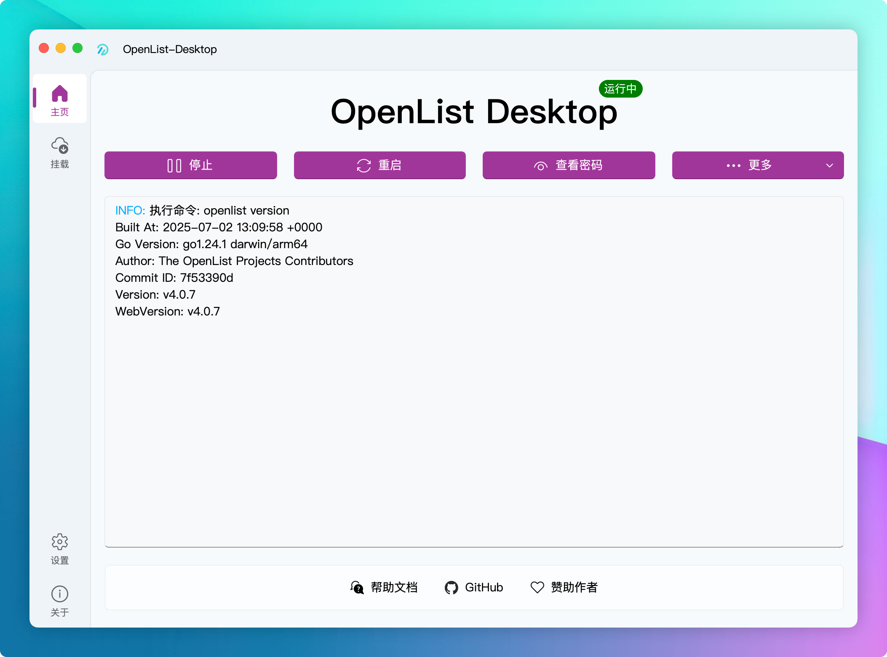

<!--
 * @Author: qianye
 * @Date: 2025-06-08 20:32:52
 * @LastEditTime: 2025-07-05 09:49:29
 * @Description: 
-->
# OpenList Desktop

<p align="center">
  
</p>
<h1 align="center">OpenList Desktop</h1>
<p align="center">
  <a href="https://github.com/qianye216/OpenList-Desktop/blob/main/LICENSE" target="_blank">
    
  </a>
  <a href="https://github.com/qianye216/OpenList-Desktop/releases" target="_blank">
    
  </a>
</p>

---

[简体中文](./README.md) | [English](./README_en.md)

## 📖 Introduction

**OpenList Desktop** is a cross-platform desktop client designed for [OpenList (Alist)](https://github.com/OpenListTeam/OpenList) and [Rclone](https://rclone.org/). It provides a modern and user-friendly graphical interface to help you easily manage the Alist service and Rclone mounts without needing to remember and type complex command-line instructions.

This project is built with Python and [PySide6](https://www.qt.io/qt-for-python), and utilizes the [QFluentWidgets](https://github.com/zhiyiYo/PyQt-Fluent-Widgets) library for a beautiful and smooth user experience.

## ✨ Features

- **Alist Service Management**: Easily start, stop, and restart the Alist service.
- **Rclone Core Service**: Manage Rclone's core `rcd` service, which powers all mounting operations.
- **Parameterized Configuration**: A graphical interface for configuring startup parameters for both Alist and Rclone.
- **Cloud Drive Mounting**: Create and manage cloud drive mounts via Rclone's HTTP API, mapping cloud storage as a local drive.
- **System Integration**: System tray support, with an option to hide the Dock icon on macOS for true background operation.
- **Auto-Startup**: Configure the application to launch on system boot, with support for silent startup.
- **Automatic Updates**: Built-in update checker for the application itself, Alist, and Rclone.
- **Personalized Themes**: Supports Light, Dark, and System-following themes, with customizable accent colors.

## 🖼️ Screenshots



## 🚀 Installation and Usage

### 1. Download the Application

Download the latest version for your operating system from the [GitHub Releases](https://github.com/qianye216/OpenList-Desktop/releases) page.

### 2. Prerequisites

#### For Rclone Mounting

To use the Rclone mount feature, you need to install the following dependencies first:

- **Windows**: Install [WinFsp](https://winfsp.dev/rel/) (Windows File System Proxy).
- **macOS**: Install [macFUSE](https://osxfuse.github.io/).
- **Linux**: Install `fuse` using your package manager. For example, on Debian/Ubuntu, run `sudo apt-get install fuse`.

#### Alist & Rclone Executables

Place your downloaded `alist` (or `openlist`) and `rclone` executables into any directory on your computer.

### 3. Configure the Application

1.  Run **OpenList Desktop** for the first time.
2.  Navigate to **Settings** -> **OpenList Settings**.
3.  Click the "Select" button next to **Working Directory** and choose the folder where your `alist` executable is located.
4.  Navigate to **Settings** -> **Rclone Settings**.
5.  Click the "Select" button next to **Working Directory** and choose the folder where your `rclone` executable is located.
6.  After configuration, you can start and manage the services from the Home and Mount pages.

## 🏗️ Project Structure

```
root
|  main.py                (Entry script)
|  requirements.txt         (Dependency file)
|
└─app
    ├─common                (Common modules: config, signal bus, utils, etc.)
    ├─components            (Custom UI components)
    ├─resource              (Resource files: icons, qss, i18n files)
    ├─services              (Core services: Alist and Rclone managers)
    └─view                  (UI Views: main window, sub-interfaces)
```

## 📄 License

This project is licensed under the [GPL-3.0 License](./LICENSE).

## 🙏 Acknowledgments

- [OpenList (Alist)](https://github.com/OpenListTeam/OpenList): A powerful list program.
- [Rclone](https://rclone.org/): The Swiss army knife of cloud storage.
- [QFluentWidgets](https://github.com/zhiyiYo/PyQt-Fluent-Widgets): An amazing Qt component library.
- All developers who have contributed to this project.